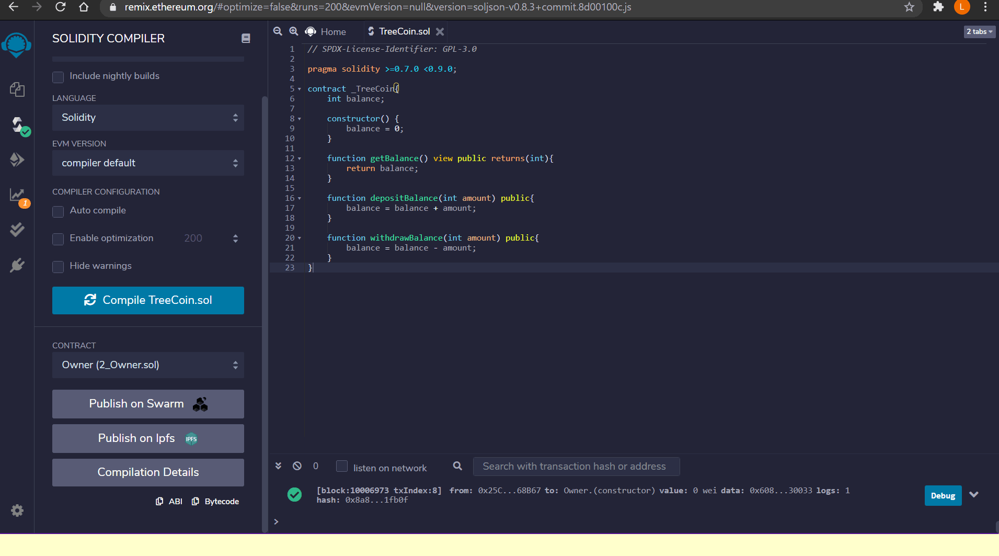
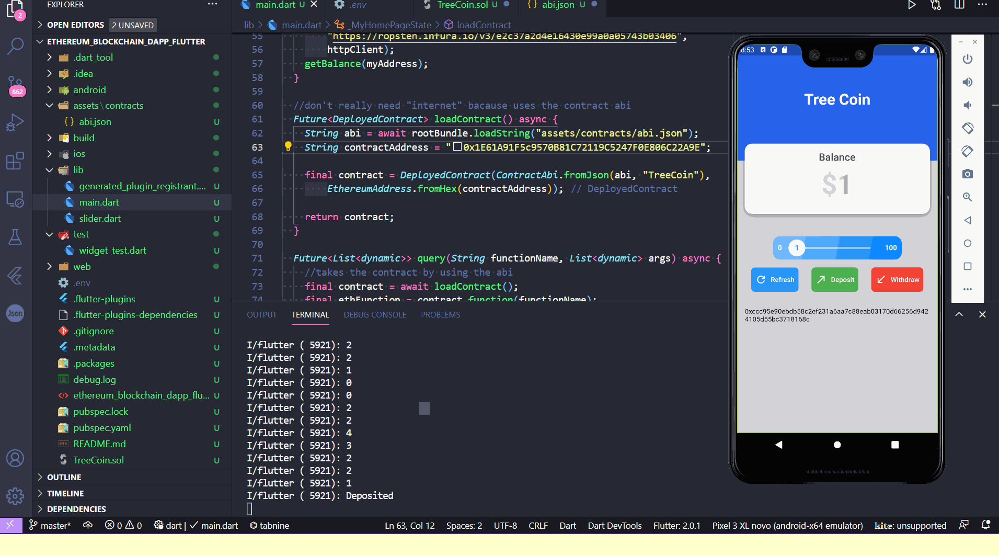
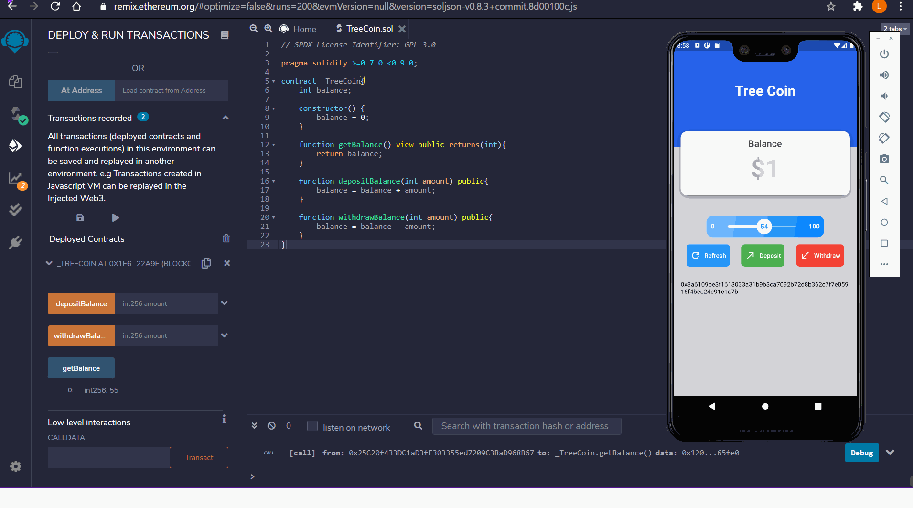
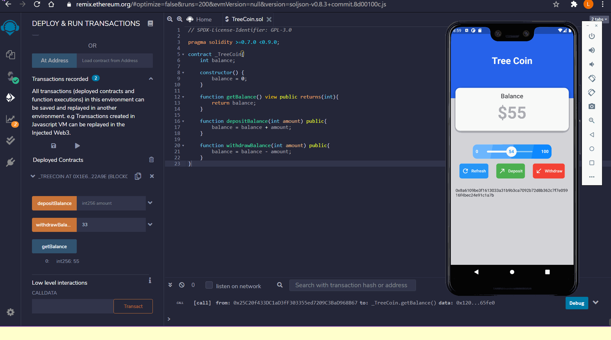
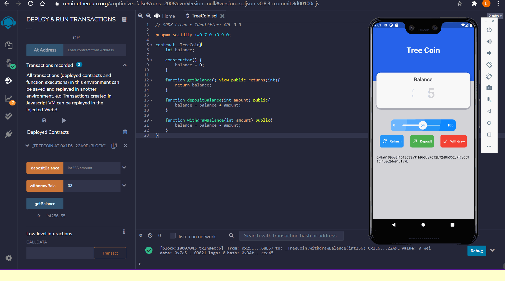
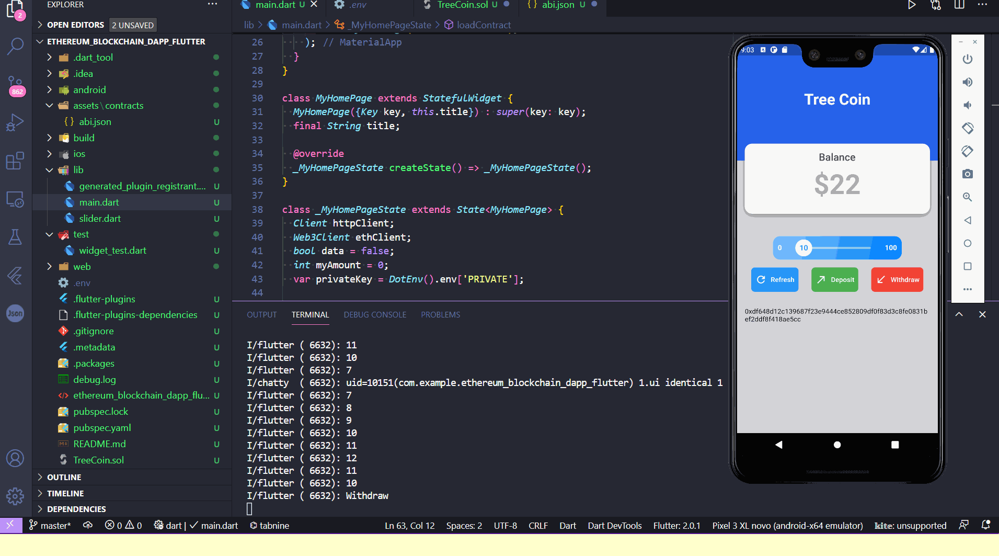

# ethereum_blockchain_dapp_flutter (https://github.com/GitLeandroHub/Ethereum_Flutter_Dapp_SmartContract_Blockchain_web3_Metamask)

A Dapp (Decentralized application) that uses smart contract (Ropsten Testnet) and Metamask for the Privatekey and wallet from Ethereum blockchain and connects all together by using Flutter framework and Dart language (Web3dart)

For this project some tools and skills were needed:
- Dart language (Web3dart)
- Solidity (for Smart Contract)
- Remix to compile and deploy the Smart Contract (Abi, contract address)
- Metamask for the Ropsten testnet wallet (wallet address and Private key)
- Vscode for the flutter and dart code and Emulation - windows desktop (Dapp)
- Infura for watch and manage the ropsten network
- .env to Avoid Uploading the Private Key to GitHub and to hide from the code itself
- velocity_x for fast and beautiful ux designs of the app

Gif showing compiler and deploy of the Smart Contract for the creation of the contract address with injected web3 wallet using ropsten testnet and Metamask

Gif showing initial status (0 balance) after the creation of the contract

Gif showing the first deposit into the contract address from the wallet

Gif showing the balance of the contract after deposit on the Dapp and on Remix

Gif showing the Transaction Hash generated from etherscan into the Dapp and checked into etherscan

Gif showing another deposit of 54 made from the dapp

Gif showing withdraw of 33 made from Remix

Gif showing balance after withdraw refresh button from Dapp 

Gif showing withdraw using button from the dapp

Last gif showing balance after the withdraw of 10

Credits and Thanks for mtechviral for the support.